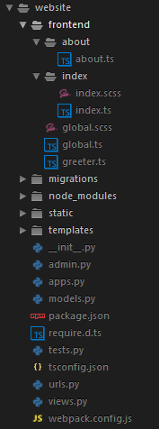

# dts-webpack

This quickstarter enables your **Django** app to leverage **TypeScript** and **SCSS** for easier front end development. It uses **Webpack** to handle the heavy lifting of transpilation, uglification, and other typical build tasks.

A primary goal of this project was to enable the inclusion of these technologies without substantially changing how JS and CSS files are included within Django templates via `` tags.

A secondary objective was to allow for developers to group `.ts` and `.scss` files by _page_, instead of by filetype. My experience as an Angular developer inspired me to follow this methodology as it allows for a more modular directory structure that encourages code re-usability.

And thus, **dts-webpack** was born!

## Prerequisites

* [npm](https://nodejs.org/en/download/)

## How to use

This project involves Django front end development, so it made sense to me that webpack-related files should reside **within an existing Django app**. Typically this will be the app serving up your HTML, JS, and CSS files.

To get started, place `package.json`, `require.d.ts`, `tsconfig.json`, and `webpack.config.js` into your Django app.

Next, update the following variables in `webpack.config.js`:

	/* Customize these */
	var outputPath = './static';
	var inputPath = './frontend/';

**outputPath** is where you want webpack to drop the processed files. If, for example, you set your Django project's `STATIC_ROOT` to `os.path.join(BASE_DIR, 'static')`, then set this to `'./static'`.

**inputPath** is where webpack should start looking for `.ts` and `.scss` files. We don't want to put any TypeScript or SCSS files into the `STATIC_ROOT` directory, so I created a `frontend/` directory and organize these files by page:

Those should be all the customizations you need to make. When everything is in place, go ahead and install all the dependencies:

	npm install

When this finishes, you'll be good to go.

With this setup, webpack will convert `.ts` and `.scss` files into individual `.js` and `.css` files respectively. Since the files are output into the app's `static/` directory, you'll be able to include them in your Django templates as usual:

	
	

	
	<link rel="stylesheet" href="">
	

	
	
	

	
	

		<h3>Hello</h3>
		<a href="">About</a>
	

	

## Additional notes

A couple of additional scripts are included in `package.json`:

* `npm start` will launch webpack in watch mode with more verbose error output.
* `npm build` will have webpack build all TypeScript and SCSS files, then run Django's `collectstatic` command.
	* This command assumes that your virtual environment is located in your root Django project folder as `venv/`
* `npm build-win` will do the same thing, but on Windows.

## TODO

* Incorporate unit testing for TypeScript files